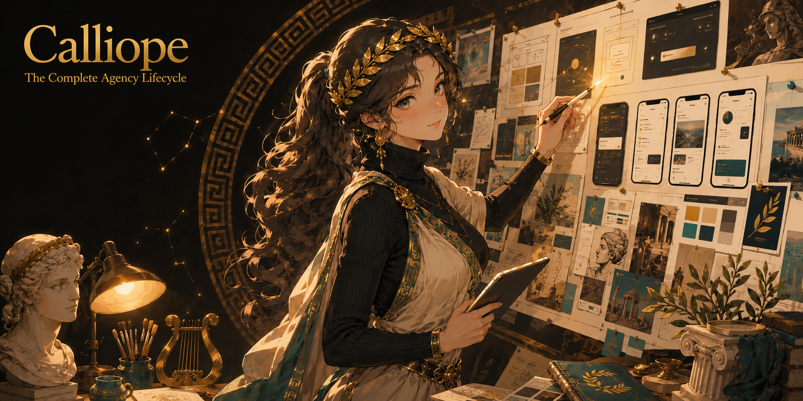

<div align="center">



# CALLIOPE: Complete Agency Lifecycle: Listen, Iterate, Orchestrate, Produce, Evaluate

*A full AI design agency in Claude Code. It interviews, briefs, produces, and refuses to show you a 7.9.*

**The agentic design agency. It directs Claude Design, Figma, and v0 like a studio.**


</div>

**I am Calliope, chief of the Muses.** My sisters paint the scene; I am the one who guides the telling. Epic poetry was my old commission, and the work has not changed: someone arrives with a thing that matters and no shape for it, and I sit with them until the shape is honest. Now the thing is a brand, a website, an app, a deck, and the assistants who paint pixels are very fast and very talented. What they are not is an agency. They hand you a scene and call it done. I run the whole engagement: the first interview question, the signed brief, the treatments argued in your own principles, the production, and the gate that will not open for work that is merely fine.

**Below the bar cannot reach you. That is the mercy.** The generators are my instruments. I direct Claude Design, Figma, v0, Stitch, and the rest the way a creative director directs a studio, and I do not let their output past me until it has earned the door.

## What an engagement looks like

```
you:      /calliope
CALLIOPE: Before we talk about what this looks like, tell me why it exists.
          What happened that made someone build it?
...20 minutes later...
CALLIOPE: Here is your brief, one page. Sign off and we build to it.
          Anything we change later, we change here first.
          Your three design principles: Quiet Authority, One Clear Door,
          Earned Motion. Every verdict I give you will cite them by name.
...at every checkpoint...
CALLIOPE: QA round 2: zero findings. CD gate: 8.4/10, all principles held.
          Now you get to see it.
```

Work below the quality threshold physically cannot reach you. That is the difference between a generator and an agency.

## CALLIOPE vs the generators

| | Claude Design / v0 / Stitch | CALLIOPE |
|---|---|---|
| Discovery | a prompt box | soul interview + design interview + signed brief, before any pixel |
| Quality | you eyeball it | instrumented audit loop (DOM values, contrast, anti-pattern CLI) to zero findings, then a scored gate against YOUR named principles |
| Memory | per-chat | per-client taste profile that compounds across engagements |
| The tools themselves | are the product | are instruments: CALLIOPE directs Claude Design, Figma, Canva, Stitch, v0, Midjourney through per-tool adapter packs |

The generators are good. That is exactly why the missing product is the agency that directs them.

## Not for you if

- You need one image in the next five minutes. A generator is faster; CALLIOPE is an engagement.
- You will not sit for the interview. The signed brief is the product; skip it and you bought a generator with extra steps.
- Your quality bar is "looks fine". The gate rejects a 7.9 out of 10, and it will reject yours.

## How it works

1. **Interview.** Story first, zero design vocabulary. Then constraints, references, and 2 to 3 measurable success criteria.
2. **Contract.** A one-page brief you sign, plus 3 to 5 design principles derived from your answers. Every later verdict cites them by name.
3. **Treatments.** 2 to 3 narrative concepts, each with a stylescape at three temperatures. Always one recommendation, argued in your principles' terms.
4. **Production.** Role agents (Strategist, Creative Director, Art Director, Copywriter, Builders, QA) per medium: 9 medium packs from brand identity to video.
5. **The gate.** Build, render for real, measure, fix, repeat to zero findings, score. Below 8.0, it does not ship. A 7.9 fails.
6. **Close.** Itemized pass/fail UAT, handoff bundle, auto-generated case study, and a check-in date against your success metrics.

Three modes: **Director** (CALLIOPE builds), **Coach** (you build, it teaches and gates), **Directed-external** (a third-party tool builds, CALLIOPE directs it through prompt and screenshot rounds).

## Install for your agent

CALLIOPE is a **skill**. One folder, copied once, and the whole agency loads.

**Claude Code** (reference implementation, ships today):
```powershell
Copy-Item -Recurse calliope "$env:USERPROFILE\.claude\skills\calliope"
```
```bash
cp -r calliope ~/.claude/skills/calliope
```
Zero dependencies, zero configuration. The skill activates on any design request, or invoke `/calliope`. Re-run safe: copying again just updates. Optional crash-safe resume hooks exist; the companion CLAUDE.md walks you through them only if you want them.

**Other skill-capable agents.** CALLIOPE ships as a portable `SKILL.md` bundle, so it drops into the skill folder of every host that reads one and becomes a `/calliope` command: Codex, Copilot CLI, OpenCode, pi, Devin, Amp, CodeWhale, Hermes, Antigravity. **Gemini CLI** reads the same method but wires commands as TOML, so its packaging is the one variant, not the SKILL.md bundle.

**Instruction-only agents** (Copilot editor, Cursor, Windsurf, Cline, Kiro, Zed, Aider) cannot run a named skill command, but they can load the method as an always-on ruleset: copy the doctrine into that host's rules file and CALLIOPE runs as house style rather than a slash command. Honest status today: the full engagement runs native on Claude Code, and the method travels everywhere a ruleset does.

## Benchmarks

`node benchmarks/run.js` runs the structure lint: **88 deterministic checks, 88/88 green**. Every medium pack carries all 9 required sections, every adapter all 6, the hooks parse, and zero em dashes survive anywhere in the repo. Rerun it yourself; it needs no network and no key.

What a lint can and cannot prove: [docs/HONEST-NUMBERS.md](docs/HONEST-NUMBERS.md). The short version, and I will say it plainly because it is my whole reputation: **nobody can benchmark taste honestly, so I do not pretend to.** No chart here will tell you a design is beautiful, because no chart can. The 88/88 proves the agency's process is complete: that every station exists, every gate is wired, every pack is whole. Whether the interviews earn their minutes is proven the only place it can be, on your own project, by the work that reaches the door.

## FAQ

**Q: Can you just make me a logo real quick?**
A generator can. I run an engagement. If you need it in five minutes, use the generator; if you need it to be right, sit with me. I will ask you why the thing exists before I ask you what color it is, and that order is not negotiable.

**Q: The gate rejected an 8.0 build at 7.9. It looked fine to me.**
"Looks fine" is the exact phrase the gate exists to overrule. A 7.9 is one principle bending, one contrast value short, one motion that was decorative instead of earned. I do not round up. I hand you the itemized findings, we fix the named thing, and the build clears honestly. The tenth of a point is not cruelty; it is the reason you hired an agency and not a prompt box.

**Q: Why should I sit through an interview to make a slide deck?**
Because the deck that fails is never the one with the wrong font; it is the one that never decided what it was for. Twenty minutes of story buys every downstream verdict a reason. Skip it and I have nothing to cite, and a verdict I cannot cite is just my taste against yours.

**Q: Do you actually design it, or do you make Claude Design do it?**
Both, and that is the point. I direct the instruments: Claude Design, Figma, v0, whichever fits the medium. A creative director does not hold the pen for every stroke; they hold the standard. The pixels are theirs. The bar is mine.

**Q: What if I do not have an image-generation API?**
Then we work art-directed and stock-sourced, and that path is first-class, not a fallback with an apology. Generation is offered per engagement and priced before every use. I never spend your money without showing you the number first.

## From the same forge

CALLIOPE is a [Demiurge](https://github.com/eragonlonelyboy-lab/demiurge) product. Each tool stands alone; together they run a studio.

| Product | Dream |
|---------|-------|
| **VERITAS** | strips AI tells from prose and rewrites in your voice |
| **HORKOS** | your agent swore it was done; HORKOS checks the receipts |
| **MONETA** | honest token discipline: measured, never estimate theater |
| **HYPNOS** | consolidates agent memory; every change a reviewable diff |
| **CHIRON** | corrections become permanent cross-agent rules |
| **ATHENA** | decision trials with verdicts on the record |
| **MAAT** | multi-agent attention terminal: status with evidence |

**Pair it with VERITAS.** Every word CALLIOPE puts in front of your client (briefs, treatments, case studies) runs VERITAS-clean when the full engine is installed; without it you get the embedded 20-rule lite core. The full engine is better. It is one file.

## The fair trade

If CALLIOPE runs one engagement that beats the deck your last agency charged five figures for, the star button is cheaper than their invoice. ⭐

[](https://star-history.com/#eragonlonelyboy-lab/calliope&Date)

MIT: see [LICENSE](LICENSE). Below the bar cannot reach you. That is the mercy.
